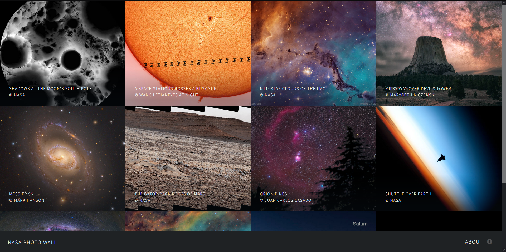
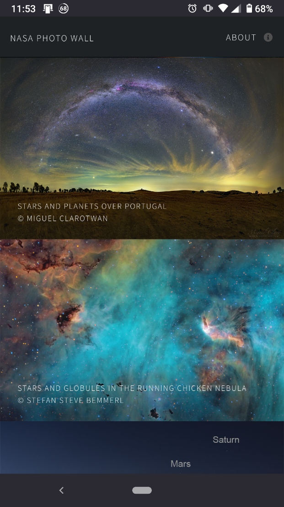

# nasa-photo-wall

A photo wall of NASA's beautiful Astronomy Picture of the Day from the last 12 days.

 

| Desktop | Mobile |
|---|---|
|  |  |

## How It's Made:

**Tech used:**   

Create a photo wall from NASA API: https://api.nasa.gov/planetary/apod

### Copyright
Because each photo is the intellectual property of the original photographer, I needed to ensure that due credit is given. Based on the documentations, I attribute the copyright to `copyright` property if present, and otherwise attribute to NASA.

## Optimizations
I used the `start_date` query parameter to obtain a range of photos in a single API call.

Additionally, the images displayed in the photowall are lower definition than the HD photos used in the poptrox in order to reduce the webpage's load time.

Some of the photos of the days are videos. But for optimization purposes, I made use of the video's still image. If I have time in the future, I will change the poptrox to have an iframe with the original video.

## Lessons Learned:
I made use of text-overflow and elipsis enforce a maximum length for the photo descriptions.
